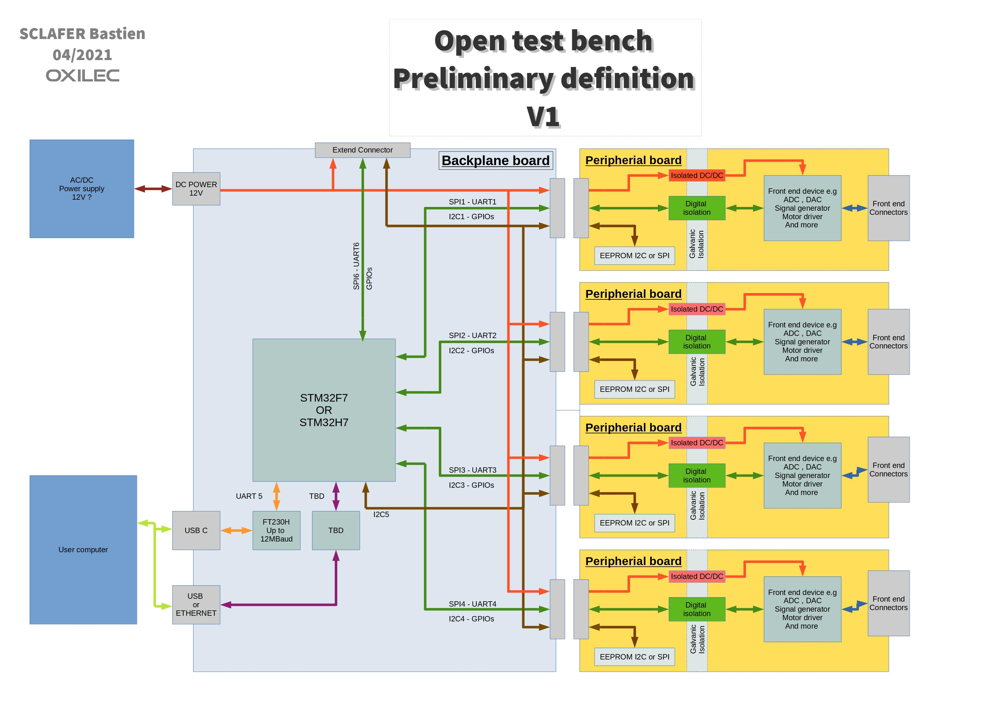

[Ce README en français](README_fr.md)
# Open test bench

## Introduction

Open test bench is an open-source platform for drive or characterize any type of system.
The system is made for simplifying the development of additional modules called "peripheral module".
User connect his computer to backplane unit which gives an access to the peripheral.

#### Composition
- Backplane unit.
- Some peripheral module.
- Module d'extension (TBD).

## Description

### Backplane unit

Backplane unit is the main block of the system.
It can receive 4 peripherals modules and link user computer to peripheral module.
More peripherals modules can be added with the extension module but with slower communication speed.

#### Backplane unit implement
- A microcontroller STM32H7.
- Some channel communication to peripheral modules(SPI 50Mhz, UART 10Mhz, I2C 1Mhz, GPIO).
- A driver UART <-> USB (FT230H) 12Mb/s.
- A driver TBD <-> USB ou ETHERNET for high speed communication.
- Connectors for plug peripheral module.
- Possibility to add extension module for low-speed peripheral modules.

### Peripheral module

Peripheral modules make links with the real world.
Each module has an access to 4 communication channels dedicated.

#### Wide capability
- Voltage/current measurement.
- Sensor measurement.
- Digital input/output.
- Power management.
- ....

#### Suggested format of peripheral module
- Galvanic isolation for simplifying referenced problems.
- EEPROM for saves needed calibration.
- Mechanical dimension (TBD), capability of a double module.

### Extension module
TBD

### Preliminary definition

